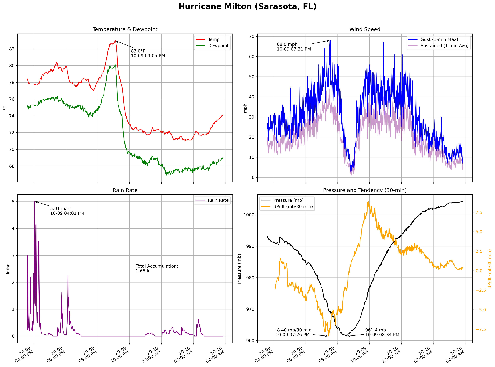
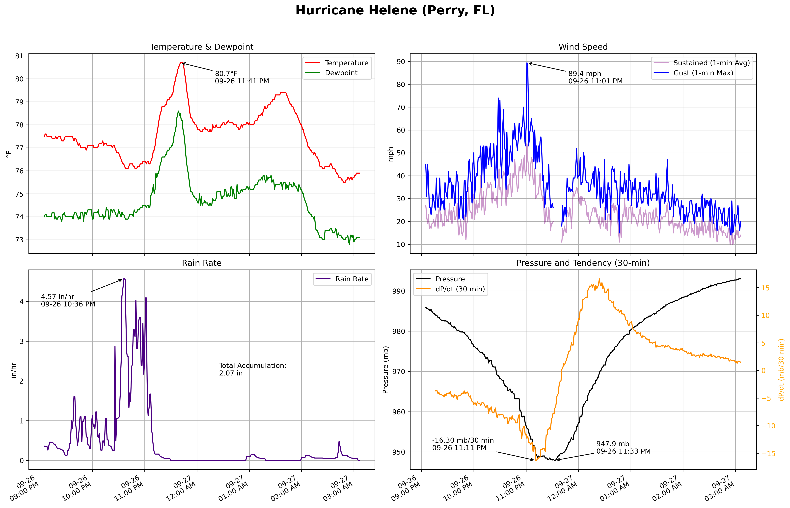

# Hurricane Intercept & Field Data Analysis

## Independent, Vehicle-based Observations & Analysis

This repository presents field observations and comprehensive analyses collected during vehicle-based intercepts of landfalling hurricanes during the 2024 Atlantic hurricane season. All data were recorded using a **Davis Vantage Pro 2** weather station mounted on a **custom-fabricated platform affixed to a truck**, designed to withstand hurricane-force conditions and collect reliable in-situ meteorological data.

The station was configured to log high-resolution observations at **1-minute intervals** during landfall. These observations were used to produce detailed visualizations capturing storm evolution and intensity.

The primary focus of these analyses includes:
- Surface pressure and pressure tendencies at multiple temporal resolutions
- Sustained wind speeds and gust observations
- Rainfall rates and total accumulations
- Temperature and dewpoint trends

The observations captured are documented through detailed plots for each intercepted storm event, presented below chronologically with the most recent hurricane first.

---

## Hurricane Milton (October 9, 2024) – Sarasota, FL

- 

### Available Plots:

- [Pressure Time Series](Images//Milton/Hurricane_Milton_MSLP.png)
- Pressure Tendencies:
  - [5-minute](Images/Hurricane_Milton_PTendency_5min.png)
  - [10-minute](Images/Hurricane_Milton_PTendency_10min.png)
  - [15-minute](Images/Hurricane_Milton_PTendency_15min.png)
  - [30-minute](Images/Hurricane_Milton_PTendency_30min.png)
- [Wind Speed and Gusts](Images/Hurricane_Milton_WindSpeed.png)
- [Temperature and Dewpoint](Images/Hurricane_Milton_Temp_Dew.png)
- [Rain Rate and Accumulation](Images/Hurricane_Milton_RainRate.png)

---

## Hurricane Helene (September 26, 2024) – Perry, FL

### Available Plots:

- [Pressure Time Series](Images/Hurricane_Helene_MSLP.png)
- Pressure Tendencies:
  - [5-minute](Images/Helene/Hurricane_Helene_PTendency_5min.png)
  - [10-minute](Images/Helene/Hurricane_Helene_PTendency_10min.png)
  - [15-minute](Images/Helene/Hurricane_Helene_PTendency_15min.png)
  - [30-minute](Images/Helene/Hurricane_Helene_PTendency_30min.png)
  - [1-hour](Images/Helene/Hurricane_Helene_PTendency_1hour.png)
- [Wind Speed and Gusts](Images/Helene/Hurricane_Helene_WindSpeed.png)
- [Temperature and Dewpoint](Images/Helene/Hurricane_Helene_Temp_Dew.png)
- [Rain Rate and Accumulation](Images/Helene/Hurricane_Helene_RainRate.png)

---

## Methods

All field observations were recorded using a **Davis Vantage Pro 2** weather station mounted on a **custom-fabricated vehicle platform**. This mobile setup enabled close-range storm intercepts and consistent exposure to the hurricane core.

The sensor suite includes:
- Barometric pressure sensor
- Temperature and humidity sensors
- Anemometer for wind speed and gust measurements
- Tipping-bucket rain gauge for precipitation rate and accumulation

The station was configured to log data at **1-minute intervals**. Pressure tendencies were computed using centered finite differences over varying intervals. All figures were generated using Python (`pandas`, `numpy`, `matplotlib`).

---

## Future Work

Planned expansions and improvements:
- Deployment of three additional autonomous weather stations for simultaneous multi-site data collection.
- A reinforced apparatus to elevate the anemometer to a height of approximately 25–30 feet to standardize wind measurements.
- Further intercepts of tropical cyclones in future hurricane seasons to expand the dataset.

**Note on Data Accessibility**: Raw observational datasets are currently restricted due to evolving meteorological data sharing policies. Figures are shared here for documentation purposes, with dataset access potentially available upon request for academic collaboration.

---

## License

This repository is provided under the MIT License. Figures and methodologies may be used for research and educational purposes with appropriate attribution.
"""
