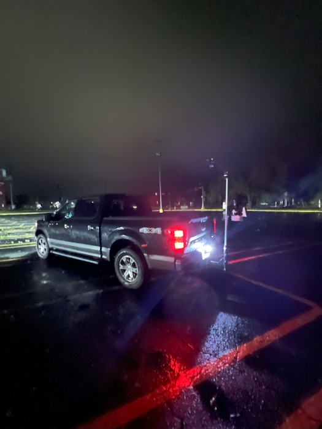
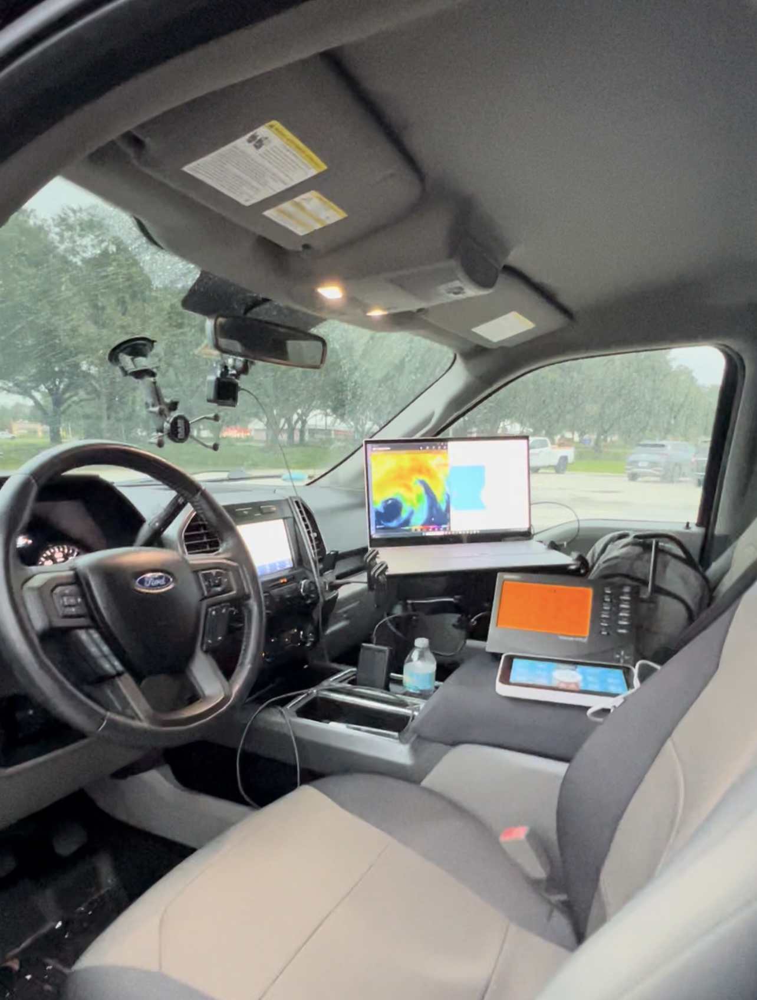

# Hurricane Intercept & Field Data Analysis

## Independent, Vehicle-based Observations & Analysis

This repository presents field observations and analyses from surface data collected during vehicle-based intercepts of landfalling hurricanes during the 2024 Atlantic hurricane season. Data was recorded using a **Davis Vantage Pro 2** weather station mounted on a **custom-built mount secured to the vehicle**, designed to withstand hurricane-force conditions and collect reliable in-situ meteorological data.

The station was configured to log high-resolution observations at **1-minute intervals** during landfall. These observations were later used to produce detailed visualizations capturing storm evolution and intensity.

The analyses include:
- Surface pressure and pressure tendencies at multiple temporal resolutions
- Sustained wind speeds and gust observations
- Rainfall rates and total accumulations
- Temperature and dewpoint trends

Observations captured are presented below chronologically with the most recent hurricane first.

---

## Hurricane Milton (October 9, 2024) – Sarasota, FL

  
  

<em><strong>Left:</strong> Reflectivity of Hurricane Milton during intercept; crosshairs mark vehicle location. <strong>Right:</strong> Vehicle and station in the eye.</em>

---

### Plots:

- [Pressure Time Series](Images/Milton/Hurricane_Milton_MSLP.png)
  
- Pressure Tendencies:
  - [5-minute](Images/Milton/Hurricane_Milton_PTendency_5min.png) 
  - [10-minute](Images/Milton/Hurricane_Milton_PTendency_10min.png)
  - [15-minute](Images/Milton/Hurricane_Milton_PTendency_15min.png)
  - [30-minute](Images/Milton/Hurricane_Milton_PTendency_30min.png)
  - [1-hour](Images/Milton/Hurricane_Milton_PTendency_1hour.png)
    
- [Wind Speed and Gusts](Images/Milton/Hurricane_Milton_WindSpeed.png)
  
- [Temperature and Dewpoint](Images/Milton/Hurricane_Milton_Temp_Dew.png)
  
- [Rain Rate and Accumulation](Images/Milton/Hurricane_Milton_RainRate.png)

---

## Hurricane Helene (September 26, 2024) – Perry, FL

  
  

<em><strong>Left:</strong> Reflectivity of Hurricane Helene during intercept; crosshairs mark vehicle location. <strong>Right:</strong> Vehicle and station in the eye.</em>

---

### Plots:

- [Pressure Time Series](Images/Helene/Hurricane_Helene_MSLP.png)
- Pressure Tendencies:
  - [5-minute](Images/Helene/Hurricane_Helene_PTendency_5min.png)
  - [10-minute](Images/Helene/Hurricane_Helene_PTendency_10min.png)
  - [15-minute](Images/Helene/Hurricane_Helene_PTendency_15min.png)
  - [30-minute](Images/Helene/Hurricane_Helene_PTendency_30min.png)
  - [1-hour](Images/Helene/Hurricane_Helene_PTendency_1hour.png)
- [Wind Speed and Gusts](Images/Helene/Hurricane_Helene_WindSpeed.png)  
  
<em>Note: Wind data during part of eye passage was omitted due to relocation of the vehicle.</em>

- [Temperature and Dewpoint](Images/Helene/Hurricane_Helene_Temp_Dew.png)
- [Rain Rate and Accumulation](Images/Helene/Hurricane_Helene_RainRate.png)

---

## Methods

All observations were recorded using a Davis Vantage Pro 2 weather station mounted on a custom-built vehicle mount. Measurements were wirelessly transmitted to a data logging console connected to a computer running Davis WeatherLink software. This enabled real-time monitoring and archival of the observations from inside the vehicle.

  
   
  <em style="font-size:smaller;">Click to watch a short clip of the station and logging setup prior to Hurricane Milton.</em>

The instrumentation suite included:

- **Barometric Pressure Sensor**: Adjusted to account for the station’s elevation above mean sea level (MSL).
- **Temperature and Humidity Sensor**: Provided ambient air temperature and humidity data.
- **Anemometer**: Captured sustained wind speeds and peak wind gusts.
- **Tipping-Bucket Rain Gauge**: Recorded rainfall rates and cumulative precipitation totals.

The station logged data at **1-minute intervals**. Pressure tendencies were computed using backward finite differences across multiple temporal intervals. All visualizations were generated using Python (`pandas`, `numpy`, `matplotlib`).

---

## Future Work

Planned expansions and enhancements to this project are already underway, with several key components actively being implemented:

- **Multi-Station Deployment**: Three additional Davis Vantage Pro 2 weather stations, along with the necessary data logging hardware, have been acquired and are being prepared for operational deployment. These units will be strategically positioned during future hurricane intercepts to enable simultaneous, multi-location surface observations and improved spatial resolution of storm impacts.

- **Adjustable Station Mount**: A reinforced and adjustable mounting apparatus has been fully developed to elevate the anemometer between 10 and 35 feet. This enhancement allows for WMO standardized wind measurements and improves the accuracy of peak wind and gust recordings for the vehicle-based station.

  
   
  <em style="font-size:smaller;"><strong>Figure:</strong> Adjustable mount developed for vehicle-based anemometer, extendable from 10 to 35 feet and secured using 1/8&quot; steel guy wires.</em>

- **Real-Time Data Transmission**: Future versions of each station may incorporate cellular or satellite-based communication modules, enabling live data transmission to cloud-based platforms. This capability would allow real-time surface condition monitoring by emergency management officials, researchers, and the public as hurricanes make landfall.

- **Balloon-Based Profiling** *(Planned)*:  
  Future efforts may include launching instrumented weather balloons from within the eye or near-core regions of landfalling hurricanes. These profiles would capture upper-air measurements typically unavailable during landfall, as aircraft reconnaissance flights are generally suspended at this stage due to hazardous turbulence. Combined with surface observations, this dataset could significantly enhance hurricane modeling and improve short-term intensity forecasts.

---

## License

This repository is provided under the MIT License. Figures and methodologies may be used for research and educational purposes with appropriate attribution.

