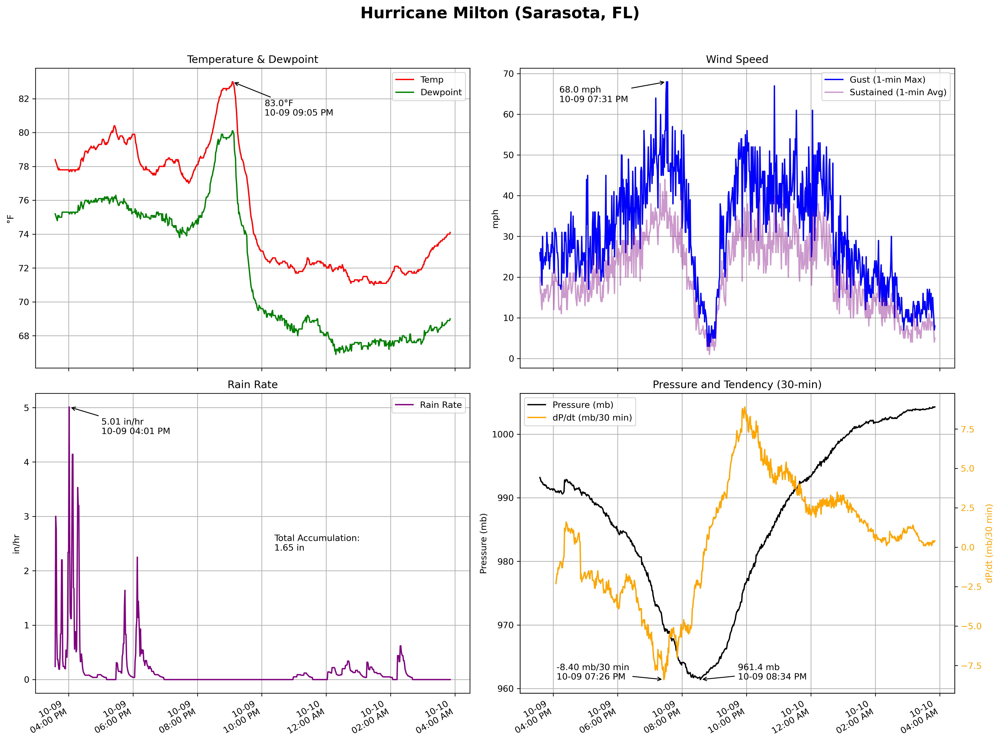
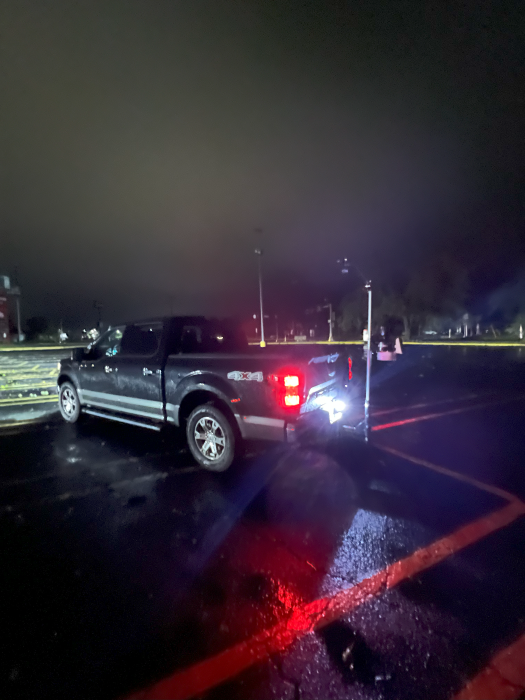
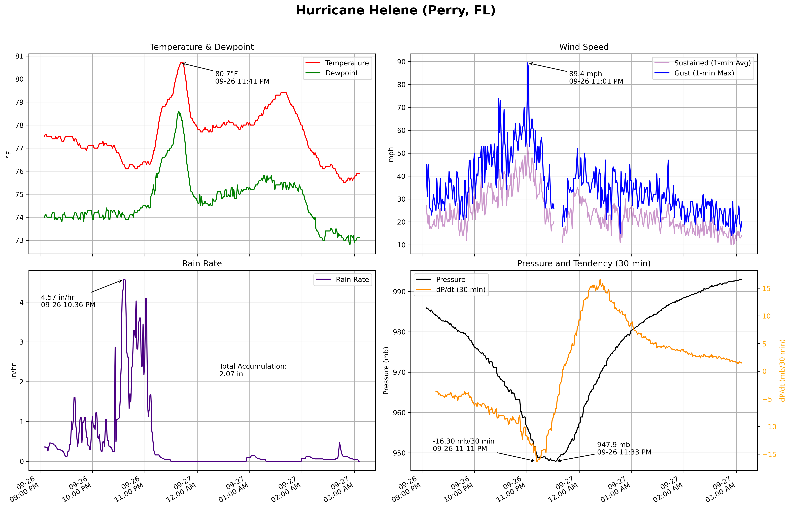

<h1 align="center">Hurricane Intercept &amp; Field Data Analysis</h1>

<h2 align="center">Independent, Vehicle-based Observations & Analysis</h2>

This website presents field observations from surface data collected during vehicle-based intercepts of landfalling hurricanes during the 2024 Atlantic hurricane season. Data was recorded using a **Davis Vantage Pro 2** weather station mounted on a custom-built mount secured to the vehicle, designed to withstand hurricane-force conditions and collect reliable in-situ meteorological data.

The station was configured to log high-resolution observations at **1-minute intervals** during landfall. These observations were later used to produce detailed visualizations capturing storm evolution and intensity.

The analyses include:
- Surface pressure and pressure tendencies at multiple temporal resolutions
- Sustained wind speeds and gust observations
- Rainfall rates and total accumulations
- Temperature and dewpoint trends

Observations captured are presented below chronologically with the most recent hurricane first.

---

<h2 align="center" style="margin:0 0 2em">Hurricane Milton (October 9, 2024) – Sarasota, FL</h2>

  

  

<em><strong>Top:</strong> Reflectivity of Hurricane Milton during intercept; crosshairs mark vehicle location. <strong>Bottom:</strong> Vehicle and station in the eye.</em>

---

 

### Plots:

- [Pressure Time Series](Images/Milton/Hurricane_Milton_MSLP.png)
  
- Pressure Tendencies:
  - [5-minute](Images/Milton/Hurricane_Milton_PTendency_5min.png) 
  - [10-minute](Images/Milton/Hurricane_Milton_PTendency_10min.png)
  - [15-minute](Images/Milton/Hurricane_Milton_PTendency_15min.png)
  - [30-minute](Images/Milton/Hurricane_Milton_PTendency_30min.png)
  - [1-hour](Images/Milton/Hurricane_Milton_PTendency_1hour.png)
    
- [Wind Speed and Gusts](Images/Milton/Hurricane_Milton_WindSpeed.png)
  
- [Temperature and Dewpoint](Images/Milton/Hurricane_Milton_Temp_Dew.png)
  
- [Rain Rate and Accumulation](Images/Milton/Hurricane_Milton_RainRate.png)

---

<h2 align="center" style="margin:0 0 2em">Hurricane Helene (September 26, 2024) – Perry, FL</h2>

<!-- Stack like Milton; fixed max width so both look identical in size -->

  

  

  <em><strong>Top:</strong> Reflectivity of Hurricane Helene during intercept; crosshairs mark vehicle location.
  <strong>Bottom:</strong> Vehicle and station in the eye.</em>

---

 

### Plots:

- [Pressure Time Series](Images/Helene/Hurricane_Helene_MSLP.png)
- Pressure Tendencies:
  - [5-minute](Images/Helene/Hurricane_Helene_PTendency_5min.png)
  - [10-minute](Images/Helene/Hurricane_Helene_PTendency_10min.png)
  - [15-minute](Images/Helene/Hurricane_Helene_PTendency_15min.png)
  - [30-minute](Images/Helene/Hurricane_Helene_PTendency_30min.png)
  - [1-hour](Images/Helene/Hurricane_Helene_PTendency_1hour.png)
- [Wind Speed and Gusts](Images/Helene/Hurricane_Helene_WindSpeed.png)  
  
<em>Note: Wind data during part of eye passage was omitted due to relocation of the vehicle.</em>

- [Temperature and Dewpoint](Images/Helene/Hurricane_Helene_Temp_Dew.png)
- [Rain Rate and Accumulation](Images/Helene/Hurricane_Helene_RainRate.png)

---

<h2 align="center">Methods</h2>

All observations were recorded using a Davis Vantage Pro 2 weather station mounted on a custom-built vehicle mount. Measurements were wirelessly transmitted to a data logging console connected to a computer running Davis WeatherLink software. This enables real-time monitoring and archival of the observations from inside the vehicle.

<!-- Embedded video: Station & logging setup (Milton) -->

  

    <iframe
      src="https://www.youtube.com/embed/FWOdxVycSVQ?rel=0"
      title="Station & logging setup prior to Hurricane Milton"
      allow="accelerometer; autoplay; clipboard-write; encrypted-media; gyroscope; picture-in-picture; web-share"
      allowfullscreen
      referrerpolicy="strict-origin-when-cross-origin"
      style="position:absolute;inset:0;width:100%;height:100%;border:0;border-radius:10px;box-shadow:0 6px 16px rgba(0,0,0,.08);">
    </iframe>
  

  <em>Short clip of the station and logging setup prior to Hurricane Milton.
  <a href="https://youtube.com/shorts/FWOdxVycSVQ?si=eooDoXEakciPfw9Q" target="_blank" rel="noopener">Watch on YouTube</a>.</em>

The instrumentation suite included:

- **Barometric Pressure Sensor**: Adjusted to account for the station’s elevation above mean sea level (MSL).
- **Temperature and Humidity Sensor**: Provided ambient air temperature and humidity data.
- **Anemometer**: Captured sustained wind speeds and peak wind gusts.
- **Tipping-Bucket Rain Gauge**: Recorded rainfall rates and cumulative precipitation totals.

The station logged data at **1-minute intervals**. Pressure tendencies were computed using backward finite differencing. All visualizations were generated using Python (`pandas`, `numpy`, `matplotlib`).

---

<h2 align="center">Future Work</h2>

Planned expansions and enhancements to this project are already underway, with several key components actively being implemented:
  

- **Multi-Station Deployment**:\
  Three additional Davis Vantage Pro 2 weather stations, along with the necessary data logging hardware, have been acquired and are being prepared for operational deployment. These units will be strategically positioned during future hurricane intercepts to enable simultaneous, multi-location surface observations and improved spatial capture of storm impacts.

     - ***Update — August 11, 2025***: All three VP2 stations and data logging hardware/shelters have been completed and are ready for deployment. See video below.

  <!-- Embedded video: Multi-station VP2 readiness (Aug 2025) -->
  

    

      <iframe
        src="https://www.youtube.com/embed/5Y_rzp0XOUs?rel=0"
        title="Multi-station VP2 readiness walk-through (Aug 2025)"
        allow="accelerometer; autoplay; clipboard-write; encrypted-media; gyroscope; picture-in-picture; web-share"
        allowfullscreen
        referrerpolicy="strict-origin-when-cross-origin"
        style="position:absolute;inset:0;width:100%;height:100%;border:0;border-radius:10px;box-shadow:0 6px 16px rgba(0,0,0,.08);">
      </iframe>
    

  

  

    <em>Walk-through of the deployable VP2 station hardware/shelter.
    <a href="https://youtube.com/shorts/5Y_rzp0XOUs?si=vvUOBHzTGN_1odu3" target="_blank" rel="noopener">Watch on YouTube</a>.</em>
  

  

- **Adjustable Station Mount**:\
  Reinforced, height-adjustable mast raises the anemometer 10–40 ft (3–12.2 m), enabling WMO 10 m–standard wind measurements and improving peak wind/gust capture on the vehicle-based station.

  
   
  <em style="font-size:smaller;"><strong>Figure:</strong> Adjustable mount developed for vehicle-based anemometer, extendable from 10 to 40 feet and secured using 1/8&quot; steel guy wires.</em>

 

  - **Website Development** *(In Progress)*:  
  This site will expand to include model data (global/regional), satellite imagery, radar products, and other useful resources. Live components include:

    - Live video streaming during intercepts.
    - Real-time weather station data streamed from the vehicle (and eventually deployed VP2 sites) with instantaneous updates and auto-refreshing plots.
   
      - ***Update — August 21, 2025***: Custom dashboard for polling real-time data from the vehicle-based station is complete.

---

<h2 align="center">License</h2>

Figures and methodologies may be used for research and educational purposes with appropriate attribution.

  
